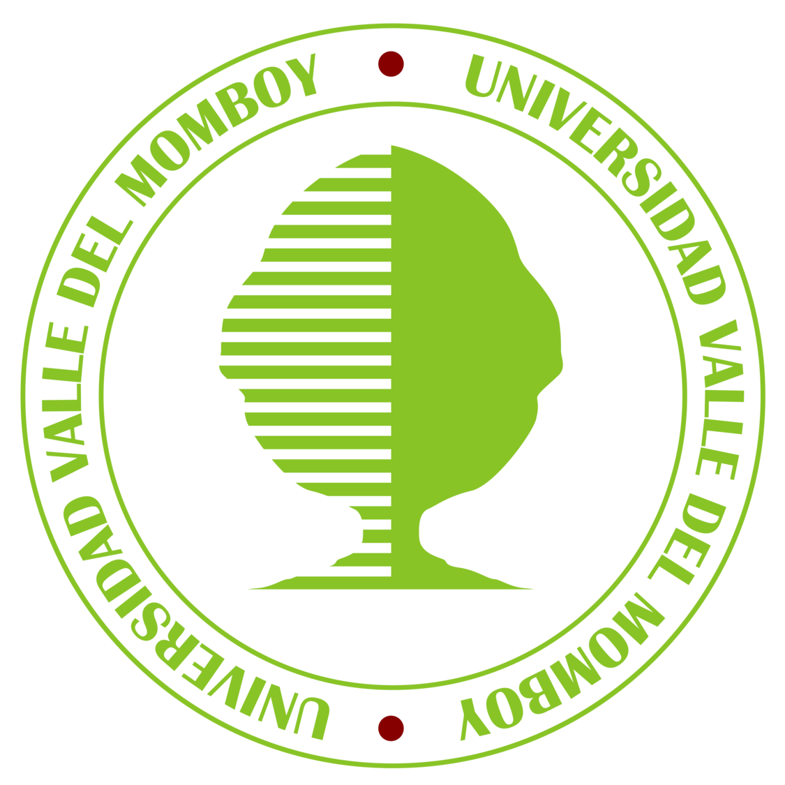
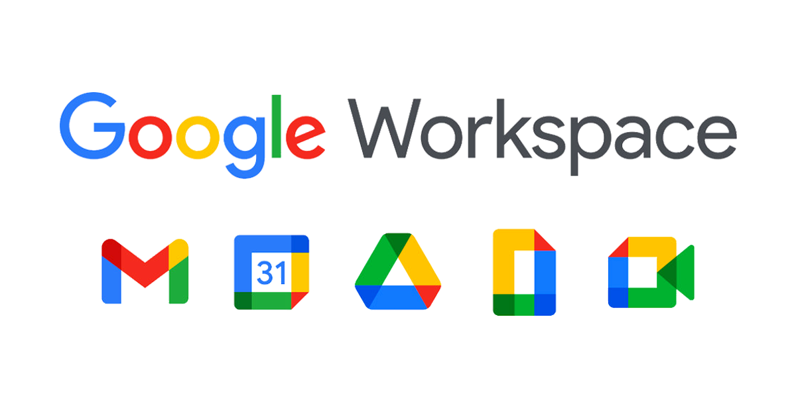
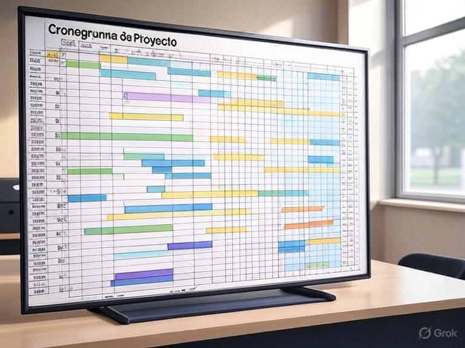
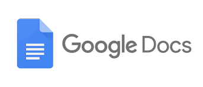

# Manual de Buenas Prácticas para Trabajos Universitarios en Grupo

Autores: Moisés Terán y José Simón García

Repositorio: https://github.com/teranMoises/Diplomado-e-Actividad-4.1

## Introducción

Este manual ofrece una guía práctica para estudiantes universitarios que realizan trabajos en grupo, como informes, ensayos, papers e investigaciones. El trabajo en equipo es esencial en la universidad, ya que fomenta habilidades como la comunicación, la colaboración y la resolución de problemas, preparándolos para entornos profesionales. Este documento, gestionado en un repositorio de GitHub, busca maximizar la productividad, mejorar la calidad del trabajo y garantizar una experiencia positiva para todos los miembros del grupo.

**Objetivos del manual**:
- Promover una comunicación efectiva entre los miembros del grupo.
- Establecer roles y responsabilidades claras.
- Definir metas y plazos realistas.
- Facilitar la escritura colaborativa y el control de versiones.
- Garantizar la integridad académica.
- Proporcionar estrategias para resolver conflictos.

## Buenas Prácticas

### 1. Comunicación

La comunicación efectiva es la base del trabajo en grupo. Establecer canales claros y accesibles asegura que todos estén alineados.

- **Reuniones regulares**: Programa reuniones semanales, presenciales o virtuales (ej., vía Zoom), para discutir avances y resolver dudas.
- **Actas de reuniones**: Designa a un miembro para tomar notas y compartirlas en un espacio compartido (ej., Google Drive).
- **Respuesta oportuna**: Responde a mensajes y correos en un plazo razonable (24-48 horas) para mantener el flujo de trabajo.
- **Canales de comunicación**: Usa herramientas como WhatsApp, Slack o Discord para actualizaciones rápidas y claras.

### 2. Definición de Roles y Responsabilidades

Asignar roles claros evita confusiones y asegura que todas las tareas estén cubiertas.

| **Rol**            | **Responsabilidades**                                                                 |
|--------------------|-------------------------------------------------------------------------------------|
| Líder del grupo    | Coordina actividades, asegura el cumplimiento de plazos, facilita reuniones.         |
| Redactores         | Escriben secciones específicas del trabajo (ej., introducción, metodología).        |
| Editores           | Revisan y corrigen el documento para garantizar coherencia y calidad.                |
| Investigadores     | Recopilan información y fuentes relevantes para el proyecto.                         |

- **Asignación basada en fortalezas**: Considera las habilidades y disponibilidad de cada miembro.
- **Rotación de roles**: Para proyectos largos, rota roles para equilibrar la carga de trabajo.

### 3. Establecimiento de Metas y Plazos

Metas claras y plazos realistas mantienen el proyecto en marcha.

- **Objetivos SMART**: Define metas Específicas, Medibles, Alcanzables, Relevantes y Temporales.
- **Cronograma**: Crea un calendario con fechas límite para cada tarea (ej., investigación: semana 1, redacción: semana 2).
- **Revisión de progreso**: Evalúa semanalmente si se cumplen los plazos y ajusta si es necesario.

### 4. Escritura Colaborativa

La redacción en grupo requiere coordinación para producir un documento coherente.

- **División del trabajo**: Asigna secciones según las fortalezas de cada miembro (ej., uno escribe la introducción, otro la discusión).
- **Estilo y formato**: Acuerda un estilo de escritura (ej., formal, técnico) y un formato de cita (APA, MLA) desde el inicio.
- **Revisión por pares**: Cada miembro revisa el trabajo de otro para identificar errores y mejorar la calidad.
- **Estructura sugerida para un paper**:
  - Introducción
  - Revisión de Literatura
  - Metodología
  - Resultados
  - Discusión
  - Conclusión
  - Referencias

### 5. Herramientas Colaborativas y Control de Versiones

Las herramientas colaborativas son esenciales para los trabajos universitarios, ya que optimizan la colaboración, mejoran la organización y desarrollan habilidades clave. Plataformas como Google Drive, Microsoft Teams, Trello y Notion son ejemplos destacados que han transformado la educación superior, especialmente en el contexto del aprendizaje a distancia. Al adoptar estas herramientas, los estudiantes no solo logran mejores resultados académicos, sino que también se preparan para un entorno laboral cada vez más digital y colaborativo.

### 6. Integridad Académica

Mantener la ética es crucial en trabajos académicos.

- **Citas adecuadas**: Usa herramientas como Zotero para gestionar y citar fuentes correctamente.
- **Originalidad**: Evita el plagio mediante redacción original y paráfrasis adecuada.
- **Herramientas antiplagio**: Si está disponible, usa software como Turnitin para verificar la originalidad.

### 7. Resolución de Conflictos

Los desacuerdos son normales, pero pueden manejarse constructivamente.

- **Comunicación abierta**: Crea un ambiente donde todos puedan expresar sus preocupaciones sin temor.
- **Mediación**: Si el conflicto persiste, busca la ayuda de un profesor o tutor.
- **Compromiso**: Propón soluciones que beneficien al grupo, priorizando los objetivos del proyecto.

## Herramientas Recomendadas

| **Categoría**              | **Herramienta** | **Descripción**                                                                 |
|----------------------------|-----------------|---------------------------------------------------------------------------------|
| Comunicación               | Slack           | Mensajería instantánea con canales organizados.                                 |
|                            | Zoom            | Videollamadas para reuniones virtuales.                                        |
| Compartición de documentos | Google Drive    | Edición colaborativa en tiempo real.                                           |
|                            | Dropbox         | Compartir archivos grandes.                                                    |
| Gestión de proyectos        | Trello          | Tableros Kanban para seguimiento de tareas.                                    |
|                            | Notion          | Espacio todo en uno para notas y tareas.                                       |
| Gestión de referencias      | Zotero          | Herramienta gratuita para organizar y citar fuentes.                           |
| Control de versiones        | GitHub          | Gestión de documentos y colaboración en Markdown.                              |

## Gestión de Proyectos

### 1. Planificación
- Define el alcance del proyecto y los entregables (ej., un informe de 10 páginas).
- Divide el proyecto en tareas manejables (investigación, redacción, edición).
- Estima el tiempo necesario para cada tarea.

### 2. Asignación de Tareas
- Asigna tareas según las fortalezas y disponibilidad de los miembros.
- Asegúrate de que todos entiendan sus responsabilidades.

### 3. Seguimiento del Progreso
- Usa herramientas como Trello para visualizar el estado de las tareas.
- Realiza reuniones semanales para discutir avances y obstáculos.

### 4. Ajustes
- Sé flexible para reasignar tareas o ajustar plazos si surgen imprevistos.

## Resolución de Conflictos

### 1. Identificar el Problema
- Escucha a todas las partes para entender el origen del conflicto.

### 2. Discusión Abierta
- Fomenta un diálogo respetuoso donde cada miembro exprese su punto de vista.

### 3. Buscar Soluciones
- Propón soluciones que satisfagan a todos, enfocándote en los objetivos del proyecto.

### 4. Acuerdo
- Llega a un consenso sobre la mejor solución.

### 5. Seguimiento
- Verifica que el acuerdo se cumpla y que el conflicto no resurja.

## Uso de Google Docs para Escritura Colaborativa

Google Docs es ideal para gestionar proyectos colaborativos, tomando en consideración las siguientes características:

- **Colaboración en Tiempo Real**: Edición simultánea con cambios visibles al instante.
- **Control de Versiones**: Historial de cambios para rastrear y restaurar ediciones.
- **Accesibilidad**: Uso desde cualquier dispositivo, con modo offline.
- **Integración**: Conexión con Google Workspace y soporte para Word/PDF.

Es por ello que ofrece varios beneficios, entre los cuales destacan:

- **Mejora del trabajo en equipo**: Edición simultánea para equipos remotos.
- **Gestión eficiente**: Control de versiones evita sobreescritura y pérdidas.
- **Comunicación clara**: Herramientas como "Help me write" agilizan mensajes.
- **Flexibilidad**: Acceso 24/7 desde cualquier dispositivo, ideal para proyectos a distancia.

## Plantilla de Contrato de Grupo

Si se desea pactar de una manera más formal las condiciones para trabajar en equipo, se propone el siguiente contrato de ejemplo. Esto es recomendable si el equipo de trabajo ha sido forzado a formarse por situaciones arbitrarias, siendo necesario marcar las pautas desde el inicio para garantizar el desempeño deseado y que cada miembro cumpla con sus deberes.

**Contrato de Grupo**  
Este contrato establece las expectativas para el proyecto [nombre del proyecto].

1. **Miembros del Grupo**  
   - Nombre: [nombre]  
     Rol: [rol]  
     Responsabilidades: [tareas]  
   *(Repetir para cada miembro)*  

2. **Comunicación**  
   - Canales: [ej., WhatsApp, Slack]  
   - Frecuencia de reuniones: [ej., semanal]  

3. **Plazos**  
   - Fecha de inicio: [fecha]  
   - Fechas clave: [lista]  
   - Fecha de entrega: [fecha]  

4. **Procedimientos**  
   - Decisiones: [ej., por consenso]  
   - Resolución de conflictos: [ej., mediación por el líder]  

5. **Sanciones**  
   - Consecuencias por incumplimiento: [ej., informe al profesor]  

**Firmado por**: [firmas de los miembros]

## Referencias
[Ver lista completa de referencias](../references/referencias.md)